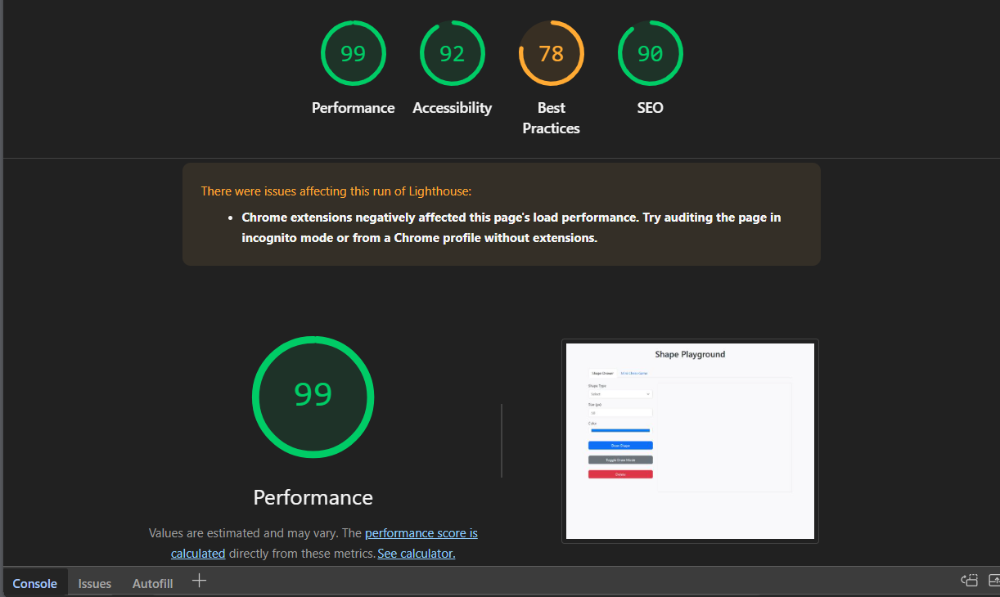

# 🎮 Shape Playground & Mini Chess Game

**Live Demo**: [https://your-project-name.netlify.app](https://fabulous-meringue-f5a5b1.netlify.app/)

## 📝 Description

This project is a fun and simple web application that includes two main features:

1. **Shape Drawing**: Allows users to draw geometric shapes (square, circle, triangle, polygon) with an interactive interface, where size and color can be customized.
2. **Mini Chess Game**: A small 8x8 chessboard with basic pieces that can be moved interactively, showing the possible moves for each piece.

---

## 📁 Project Structure

- `index.html` – Main HTML page.
- `js/shape.js` – JavaScript file for shape drawing and polygon logic.
- `js/chess.js` – JavaScript file for the mini chess game.
- `css/style.css` – Used to style the interface.
- External Libraries Used:
  - Bootstrap 5
  - jQuery
  - GSAP (for animations)
  - SVG.js (for drawing shapes on canvas)

---

## 💡 Features

### Shape Drawing Module:

- **Custom Polygon Drawing**: Create polygons by clicking multiple points on the canvas.
- **Drag & Drop**: All shapes can be moved interactively.
- **Animated Creation**: Shapes appear with smooth GSAP animations.
- **Clear Canvas**: Reset all drawings with one click.

### Mini Chess Game:

- **Dynamically Generated Board**: Chessboard is created on button click.
- **Interactive Movement**: Move kings and rooks with valid move highlighting.
- **Visual Feedback**: Possible moves are highlighted in yellow.
- **Smooth Animations**: Piece movements animated with GSAP.

---

## 📊 Performance Analysis

### Key Metrics:

- **Performance Score**: 99/100
- **Accessibility**: 92/100
- **Best Practices**: 78/100
- **SEO**: 90/100

### Notes:

- The near-perfect performance score indicates excellent loading speed and responsiveness.
- Chrome extensions may slightly affect results - for accurate testing, use incognito mode.
- The application follows modern web development best practices for optimal user experience.

### Mobile UX Improvements:
- Added touch visual feedback with animated circles
- Improved button sizing and spacing for touch targets
- Added status indicator for draw mode
- Enhanced form elements for better touch interaction

---

## 🧑‍💻 How to Run

1. Make sure all project files are organized as follows:
   - `index.html`
   - `js` folder containing `shape.js` and `chess.js`
   - `css` folder with `style.css`
2. Open `index.html` in any modern browser (recommended: Chrome or Firefox).

---

## 📌 Usage Notes

- **Polygon Drawing**:
  1. Activate "Toggle Draw Mode"
  2. Click at least 3 points on canvas
  3. Click "Draw the polygon"
- **Chess Game**:
  - Click on a piece to see possible moves (highlighted in yellow)
  - Click on highlighted square to move piece
  - Currently supports Kings (♔/♚) and Rooks (♖/♜)

---

## 🚀 Technical Highlights

- **Optimized Performance**: Achieved 99/100 Lighthouse score through:
  - Efficient DOM manipulation
  - Smart resource loading
  - Minimal dependencies
- **Responsive Design**: Adapts to different screen sizes using Bootstrap
- **Modern Animations**: GSAP library for smooth visual effects
- **Interactive Canvas**: SVG.js for precise shape rendering

  ### 📡 CDN vs NPM: Why This Choice?

One notable design decision in this project was to use **CDN (Content Delivery Network)** links instead of **NPM packages** for including external libraries such as Bootstrap, jQuery, GSAP, and SVG.js. This approach was selected for the following benefits:

- ✅ No need for installing Node.js or running `npm install`
- ✅ Lightweight and easily shareable project structure
- ✅ Runs instantly in the browser with no build step
- ✅ Leverages fast, globally distributed CDN servers
- ✅ Ideal for educational or demo purposes
